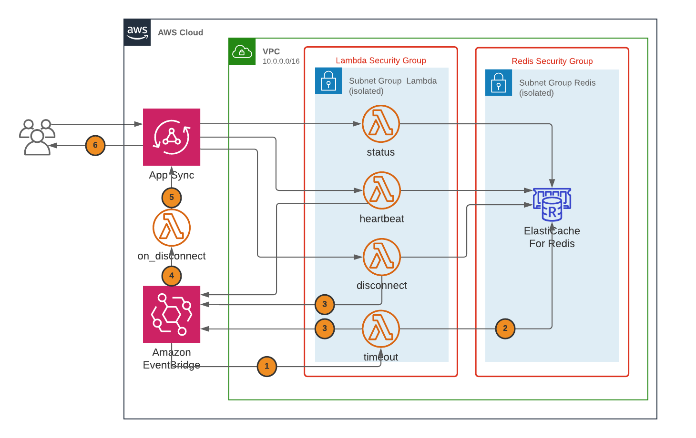

# Presence API using Amazon AppSync, AWS Lambda, Amazon Elasticache and EventBridge

This repository contains code to deploy a Presence API using Amazon AppSync, AWS Lambda, Amazon Elasticache and Amazon EventBridge. The main purpose is to give an example of API developement using those elements, and it is kept as simple as possible.   
Presence APIs are often used for game backend, their main goal is to maintain player's connection state: offline or online as they connect or disconnect to the back end. In this case, it is also built to notify clients in real time about changes in connection states. And finally, in order to be extended or integrated with other possible backend services, it uses an **Event Sourcing** pattern for communication.

You can also find more details on the infrastructure in the [associated blog post](./blogpost/Post.md).

## Prerequisites
To use this repository, you will need an [AWS Account](https://aws.amazon.com/free/), as well as AWS credentials properly setup to access your account resources from the code (see ["Configuring the AWS CLI"](https://docs.aws.amazon.com/cli/latest/userguide/cli-chap-configure.html)).


## Installation
The infrastructure is defined using [AWS Cloud Development Kit](https://aws.amazon.com/cdk/). You might need to install it globally if you do not have it yet:
`npm install -g aws-cdk`
To use the repository you can fork it or `git clone` it locally. Once you have the repository, you will have to install the require packages in the different directories:   

```bash
$ npm install
$ cd src/layer/nodejs && npm install
$ cd ../../functions/on_disconnect && npm install
```
> The AWS Cloud Development Kit is currently still being updated frequently, and new versions sometimes introduce breaking changes. The last version tested for this repository is `1.68.0`.

Along with the typescript `npm run build` and `npm run watch` commands (see: [Working with the AWS CDK in TypeScript](https://docs.aws.amazon.com/cdk/latest/guide/work-with-cdk-typescript.html)), the npm package comes with a few additional commands :
- `npm run deploy`: launches the build command (typescript transpilation) followed by the `cdk deploy` command.
- `npm run test-stack`: build and launches the stack unit tests
- `npm run test-fn`: build and launches the lambda function unit tests
- `npm run test-api`: build and launches the api integration tests

See below for more information on the unit tests.

## Architecture
Here is the architecture deployed by the CDK scripts:



It is composed of:
- An [Amazon VPC](https://aws.amazon.com/vpc) or Virtual Private Cloud to contain and isolate the resources at network level with:
  - Two private **subnets**: one for the Redis cluster, one for the Lambda function.
  - Two **security groups**, one for each subnet.
- An [Amazon Elasticache](https://aws.amazon.com/elasticache) Redis cluster to store the presence data.
- A set of [AWS Lambda](https://aws.amazon.com/lambda) functions:
  - Four of them are placed inside a subnet to have access to the Redis store.
  - One is outside the VPC, so it can easily access the GraphQL endpoint.
- An [AWS AppSync](https://aws.amazon.com/appsync) deployment to implement the GraphQL endpoint.
- An [Amazon EventBridge](https://aws.amazon.com/eventbridge) endpoint (or private link) to allow Lmabda function in the VPC to send events.

There are two different scripts to build the stack in the `lib` folder:
- `schema.ts` describes the GraphQl schema as code first
- `presence-stack.ts` describes the main stack, including the previous schema

Use either `npm run deploy` or `cdk deploy` to deploy the infrastructure in your account. The second command assumes you have built the typescript files before running it.

## Lambda functions
The source code of the Lambda functions is stored in subfolders of the `src` folder. The functions are written in plain Javascript instead of Typescript for simplicity: using Typescript would require an additional build step for the assets.
The `src` folder also contains a `layer` subfolder with the common modules used by most of the functions to access the Redis cluster.
The `on_disconnect` function includes its own node modules as it's the only one accessing the AppSync api.

## Tests
There are some tests available in the `/test` subfolder, mostly given out as example. They are not intented for full coverage of the code. They are build using the [Jest](https://jestjs.io/en/) framework. This subfolder also contains a `mock` to gather simple mocking implementations of some AWS services (such as AppSync) used for unit tests. The three type of tests are:
- **stack**: test the stack output from the CDK commands.
- **functions**: unit tests to test the lambda functions handler mainly.
- **integration**: integration tests that can be run against a test or staging environment

The `integration` test subfolder also contains an `apiclient` that is a sample implementation of the presence API.

> Regarding the integration test, the notification tests are relying on some `delay` to make sure the notifications are sent back. You can modify the `delayTime` value inside the code in case some tests fail to check if it's due to network latency.
> Running the integration tests, the **jest CLI** might display an error due to *asynchronous operations that weren't stopped*. The `aws-appsync` library does not provide a function to close its connection to the API, the connection being closed after some idle time.