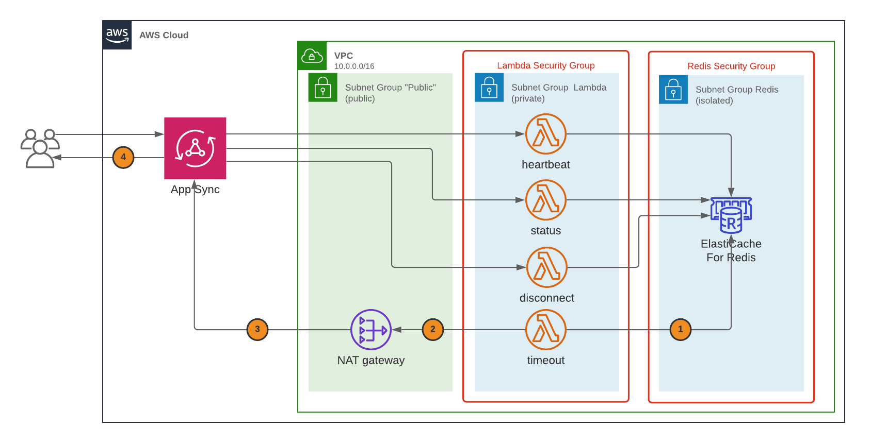
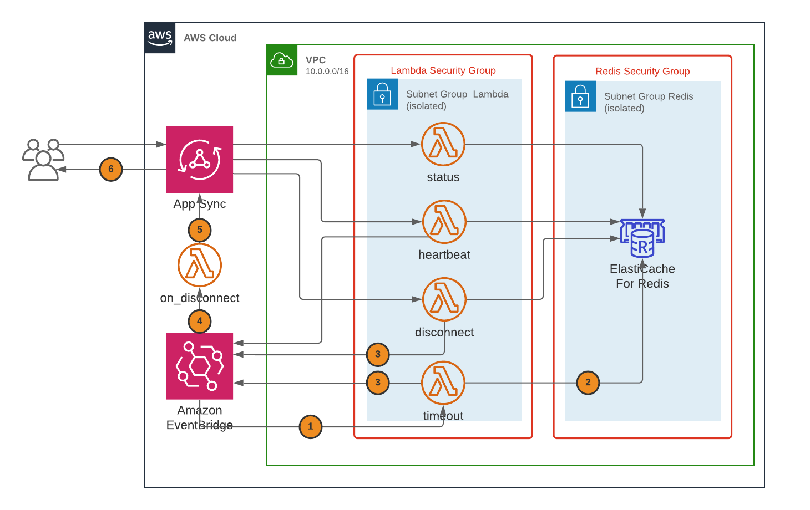

# Building a Presence API using Amazon AppSync, AWS Lambda and Amazon Elasticache

## Introduction
When developing a video game, whether a single player or multiplayer one, social and competitive features help create a network effect and increase players' engagement. These features usually require a backend API. Among them, presence information let players know about online status changes of other players, to be able to challenge them quickly, or invite them for a game session.

AWS provides developers with a wide spectrum of choice to develop backend services, from plain Amazon EC2 instances based servers to containers and serverless. Among those, [AWS AppSync](https://aws.amazon.com/appsync) simplifies application development by letting you create a flexible API to securely access, manipulate, and combine data from one or more data sources. AppSync is a managed service that uses GraphQL to make it easy for applications to get exactly the data they need. One interesting feature of Amazon AppSync is real time updates, with which you can notify players about changes on the backend. 

To subscribe to and get notifications, a game client connects to an AWS AppSync endpoint via a websocket connection. As of today, AWS AppSync does not provide events related to client connections or disconnections. This post describes a solution to build a Presence API using [AWS AppSync](https://aws.amazon.com/appsync), [AWS Lambda](https://aws.amazon.com/lambda), [Amazon Elasticache](https://aws.amazon.com/elasticache) and [Amazon EventBridge](https://aws.amazon.com/eventbridge/).

## Defining a Presence API in GraphQL
For this example, we will keep the API as simple as possible. Each player will be associated with a `status` that could take two different values, `"online"` or `"offline"`. Our API provide three basic operations:
* `connect` **mutation**: to be called when a player opens it websocket connection
* `disconnect` **mutation**: to be called when the player gracefully quits the game (and closes her connection)
* `status` **query**: to retrieve the current status of one player

There is one additional and more elaborate use case. The player can be disconnected from the backend for different reasons: client crashes, network interruptions, or even intentionnally to cheat. Still, we want other players to be informed of the disconnection even when the `disconnect` operation is not called. To do so, the game client sends regular signals to the backend, called `heartbeat`, and a threshold (or timeout) is set to consider if the player is still online or not. As game clients perform reconnection attempts when disconnected, it's important to carefully define both the heartbeat interval and the threshold to avoid the blinking player effect, whose status switches quickly from connected to disconnected. 

Finally, we will have some **subscriptions** added to our API for players to receive notifications when another player's status changes. The `@aws_subscribe` annotation is specific to AWS AppSync and specify the mutations that will trigger the notification. The final schema of the AWS AppSync looks like this:   
```graphql
enum Status {
	online
	offline
}
type Presence {
	id: ID!
	status: Status!
}
type Mutation {
	connect(id: ID!): Presence
	disconnect(id: ID!): Presence
  disconnected(id: ID!): Presence
}
type Query {
	heartbeat(id: ID!): Presence
	status(id: ID!): Presence
}
type Subscription {
	onStatus(id: ID!): Presence
		@aws_subscribe(mutations: ["connect","disconnect","disconnected"])
}
```
## Presence data storage
AWS AppSync enables developers to decouple the GraphQL schema that is accessed by their client applications from the data source, allowing them to choose the right data source for their workload.

*AppSync Architecture (Ref: [AWS AppSync System Overview and Architecture](https://docs.aws.amazon.com/appsync/latest/devguide/system-overview-and-architecture.html))*    
For presence data, knowing if a player is still online can be translated into *the last hearbeat did not happen before the given timeout*. This information is similar to session information you would have on a website, and Amazon Elasticache is a good fit for this use case. (Ref: [Session Management](https://aws.amazon.com/caching/session-management/)). The key/value cache could store a player id as the key, and the heartbeat as the value. We also want to be able to quickly retrieve sessions that have expired during a time interval, which explains the choice of [Redis Sorted Sets](https://redis.io/topics/data-types), using operations such as `ZADD`, `ZSCORE`, `ZRANGEBYSCORE`, or `ZREMRANGEBYSCORE`.

## Architecture Overview


The infrastructure is defined using [AWS Cloud Development Kit](https://aws.amazon.com/cdk/), an open source software development framework to model and provision your cloud application resources using familiar programming languages, in this case typescript. AWS CDK provides high level constructs, allowing developers to describe infrastructure with a few lines of code, while following the recommended best practices for security, reliability or performance. It also gives the possibility to use more advanced programming features such as functions or loops.

### Network overview
Elasticache Redis Cluster are deployed within an Amazon VPC. As seen in the diagram, this VPC is divided into three subnet groups:
- the **Redis** subnet group: fully private for the cluster deployment
- the **Lambda** subnet group: in order to access the Redis endpoints, the lambdas functions have to be deployed inside the same VPC.
- a **public** subnet group: the `timeout` lambda function requires access to the AppSync endpoint to call mutations. As of today, AWS AppSync does not provide [private link](https://aws.amazon.com/fr/privatelink/), so the function has to access AppSync through a [NAT Gateway](https://docs.aws.amazon.com/vpc/latest/userguide/vpc-nat-gateway.html), which in turn requires public subnets.

For high availability, we use a multi-AZ (Availability Zone) deployment, which requires definitions for one subnet ressource per AZ and group in our stack, as well as a route table to handle traffic from the Lambda subnets to the internet. Fortunately, this is where AWS CDK comes in handy with the `Vpc`construct:
```typescript
this.vpc = new EC2.Vpc(this, 'PresenceVPC', {
  cidr: "10.42.0.0/16",
  subnetConfiguration: [
    // Subnet group for Redis
    {
      cidrMask: 24,
      name: "Redis",
      subnetType: EC2.SubnetType.ISOLATED
    },
    // Subnet group for Lambda functions
    {
      cidrMask: 24,
      name: "Lambda",
      subnetType: EC2.SubnetType.PRIVATE
    },
    // Public subnets required for the NAT Gateway
    {
      cidrMask: 24,
      name: "Public",
      subnetType: EC2.SubnetType.PUBLIC
    }
  ]
});
```
The `Vpc` construct takes care of creating subnets in different AZs, and, by choosing the right combination of `SubnetType`, create other necessary resources, such as the NAT Gateway, and route tables.
We can then create both security groups inside the VPC to allow incoming traffic on Redis group only from the security group attached to the Lambda functions, as well as create a multi-AZ Redis cluster with a read replica.

### AWS AppSync API
The next part of the stack setup concerns the AWS AppSync API.

Using Lambda functions, we can take advantage of [Direct Lambda Resolvers](https://aws.amazon.com/blogs/mobile/appsync-direct-lambda/) feature for AWS AppSync. For each query and mutation, a resolver is created with the corresponding lambda data source, and attached to the relevant schema field.   
The Lambda functions code is rather simple, they can access the queries and mutations arguments directly from the event argument, and perform the corresponding Redis operation. As our functions have to access the Redis cluster, we use a [lambda layer](https://aws.amazon.com/blogs/compute/using-lambda-layers-to-simplify-your-development-process/) containing the `redis` module. Here is the heartbeat function code for example:
```javascript
const redis = require('redis');
const { promisify } = require('util');
const redisEndpoint = process.env.REDIS_HOST;
const redisPort = process.env.REDIS_PORT;
const presence = redis.createClient(redisPort, redisEndpoint);
const zadd = promisify(presence.zadd).bind(presence);

/**
 * Heartbeat handler:
 * use zadd on the redis sorted set to add one entry
 * 
 * @param {object} event 
 */
exports.handler =  async function(event) {
  const id = event && event.arguments && event.arguments.id;
  if (undefined === id || null === id) throw new Error("Missing argument 'id'");
  const timestamp = Date.now();
  try {
    await zadd("presence", timestamp, id);
  } catch (error) {
    return error;
  }
  return { id: id, status: "online" };
}
```
The `ZADD` redis command can both add a new entry in the set, or update the entry score if it exists. Therefore, the corresponding lambda data source can also be used by both the connect mutation and the heartbeat query.
If you look at the CDK code that creates the resolvers or datasources, there is nothing related to the creation of IAM role to give permissions to AppSync to call the functions: this is also automatically handled by the CDK constructs.

### Handling expired connection
The process of handling expired connection follows the steps annotated in the above diagram:
1. Triggered at regular intervals, the `timeout` function retrieves expired connections and remove them from the sorted set
2. It performs one AppSync `disconnected` **mutation** per disconnection through the NAT Gateway
3. AppSync triggers notification for each disconnection to inform subscribed players

We need to modify the GraphQL schema with this additional `disconnected` **mutation**:
```graphql
type Mutation {
	connect(id: ID!): Presence
	disconnect(id: ID!): Presence
  disconnected(id: ID!): Presence
    @aws_iam
}

type Subscription {
	onStatus(id: ID!): Presence
		@aws_subscribe(mutations: ["connect","disconnect","disconnected"])
}
```
The `@aws_iam` annotation informs AWS AppSync that this specific **mutation** requires AWS IAM authentication, through a specific role that the lambda function will assume. You can learn more about AWS AppSync multiple authorization modes [in this article](https://aws.amazon.com/blogs/mobile/supporting-backend-and-internal-processes-with-aws-appsync-multiple-authorization-types/).

Finally, here is the code for the `timeout` function:
```javascript
const redis = require('redis');
const { promisify } = require('util');
const timeout = parseInt(process.env.TIMEOUT);
const graphqlEndpoint = process.env.GRAPHQL_ENDPOINT;

// Initialize Redis client
const redisEndpoint = process.env.REDIS_HOST;
const redisPort = process.env.REDIS_PORT;
const presence = redis.createClient(redisPort, redisEndpoint);

// Initialize GraphQL client
const AWS = require('aws-sdk/global');
const AUTH_TYPE = require('aws-appsync').AUTH_TYPE;
const AWSAppSyncClient = require('aws-appsync').default;
const gql = require('graphql-tag');
const config = {
  url: graphqlEndpoint,
  region: process.env.AWS_REGION,
  auth: {
    type: AUTH_TYPE.AWS_IAM,
    credentials: AWS.config.credentials,
  },
  disableOffline: true
};
const gqlClient = new AWSAppSyncClient(config);
// The mutation query
const mutation = gql`
  mutation expired($id: ID!) {
    expired(id: $id)
  }
`;

exports.handler =  async function() {
  const timestamp = Date.now() - timeout;
  // Use a transaction to both retrieve the list of ids and remove them.
  const transaction = presence.multi();
  transaction.zrangebyscore("presence", "-inf", timestamp);
  transaction.zremrangebyscore("presence", "-inf", timestamp);
  const execute = promisify(transaction.exec).bind(transaction);
  try {
    const [ids] = await execute();
    if (!ids.length) return { expired: 0 };
    // Create and send all mutations to AppSync
    const promises = ids.map(
      (id) => gqlClient.mutate({ mutation, variables: {id} })
    );
    await Promise.all(promises);
  } catch (error) {
    return error;
  }
}
```

Finally, in order to trigger notification in AppSync, we use a specific **mutation** named `disconnected`. This mutation is attached to a [local resolver](https://docs.aws.amazon.com/appsync/latest/devguide/tutorial-local-resolvers.html): it just forward the result of the request mapping template to the response mapping template, without leaving AppSync, while triggering notifications to subscribed clients. 

## Event based evolution
Now we have a working Presence API. However, it was defined without the context of other backend APIs such as a friend or challenge API. Those other APIs might also be interested to know if a player has been disconnected, to perform some updates or clean up on their side.

Another issue with this first version is that there are two differentiated paths to disconnect the user, one using the `disconnect` **mutation** on the API, one through the `disconnected` **mutation** from the timeout function. When users disconnect themselves, other services won't be notified. To be consistent, we modify the `disconnect` function to send a disconnection event to our event bus as well. Here is the evolved architecture:



1. EventBridge triggers the `timeout` function
2. The function retrieves and removes expired connections
3. The function sends events to the custom event bus (as the `disconnect` function does too)
4. The event bus triggers lambda function `on_disconnect` set as target
5. The `on_disconnect` function sends a `disconnected` mutation to AppSync
6. AppSync notifies clients that subscribed to this mutation

Also note that the `heartbeat` function is now sending **connect** events to the EventBridge bus, that can be used by other backend services as well.

### Network evolution
One interesting point in the diagram, is that lambda functions are not directly connected to AppSync anymore, which removes the need to have private / public subnets and a NAT Gateway. And as EventBridge supports [interface VPC Endpoint](https://docs.aws.amazon.com/eventbridge/latest/userguide/eventbridge-and-interface-VPC.html), we add one to our VPC so that Lmambda function inside the VPC can access the service directly:   
```typescript
// Add an interface endpoint for EventBus
this.vpc.addInterfaceEndpoint("eventsEndPoint", {
  service: InterfaceVpcEndpointAwsService.CLOUDWATCH_EVENTS,
  subnets: this.vpc.selectSubnets({subnetGroupName: "Lambda"})
})
```

### Event Rules and Targets
The next step is to define events and the rule that trigger them. The stack creates an event rule attached to the custom event bus:
```typescript
// Rule for disconnection event
new AwsEvents.Rule(this, "PresenceExpiredRule", {
  eventBus: presenceBus,
  description: "Rule for presence disconnection",
  eventPattern: {
    detailType: ["presence.disconnected"],
    source: ["api.presence"]
  },
  targets: [new AwsEventsTargets.LambdaFunction(this.getFn("on_disconnect"))],
  enabled: true
});
```
The important points here are:
* The **eventPattern**: it defines the events that will trigger this rule, in this case all events that will have their `detailType` and `source` both match one of those in the rule definition, all other event fields are ignored.
* The **targets**: the `on_disconnect` function is added as a target to the rule.
EventBridge rules allow for multiple targets to be triggered by a single rule, which will allow the usage of a fan-out model, where the event can trigger other target for other services.   

What remains to do is to change the code of our `timeout` and `disconnect` functions to send events to EventBridge. Here is the main handler for the `timeout` function as an example:
```javascript
exports.handler =  async function() {
  const timestamp = Date.now() - timeout;
  const transaction = presence.multi();
  transaction.zrangebyscore("presence", "-inf", timestamp);
  transaction.zremrangebyscore("presence", "-inf", timestamp);
  const execute = promisify(transaction.exec).bind(transaction);
  try {
    const [ids] = await execute();
    if (!ids.length) return { expired: 0 };
    // putEvents is limited to 10 events per call
    let promises = [];
    while ( ids.length ) {
      const Entries = ids.splice(0, 10).map( (id) => {
        return {
          Detail: JSON.Stringify({id}),
          DetailType: "presence.disconnected",
          Source: "api.presence",
          EventBusName: eventBus,
          Time: Date.now()
        }
      });
      promises.push(eventBridge.putEvents({ Entries }).promise());
    }
    await Promise.all(promises);
    return { expired: ids.length };
  } catch (error) {
    return error;
  }
}
```

### Deploying the sample
You can get the full source code from the github samples here: [GITHUB REPO LINK]. More details and deployment instructions are included in the README file. The repository deploys the event version of the architecture.

## Conclusion
If you already have an AppSync based API for your backend, you can easily add a presence API to it with a set of simple lambda functions and a Redis Cluster. The simple version of the API could be used if there is no need to connect with or decouple it from your existing services.
The event based version of this API allows hooking other existing services from your backend, by registering an additional target to the existing rule. As rule targets can be of [many different types](https://docs.aws.amazon.com/eventbridge/latest/userguide/eventbridge-targets.html), including Amazon EC2 instances, Amazon ECS instances, Amazon API Gateway REST API endpoints, it could also be use to extend other kind of existing backends.
Finally, Amazon EventBridge proposes a feature to [archive and replay events](https://aws.amazon.com/about-aws/whats-new/2020/11/amazon-eventbridge-introduces-support-for-event-replay/), which makes it even more useful, for example to replay a series of events to debug or review interactions between players.